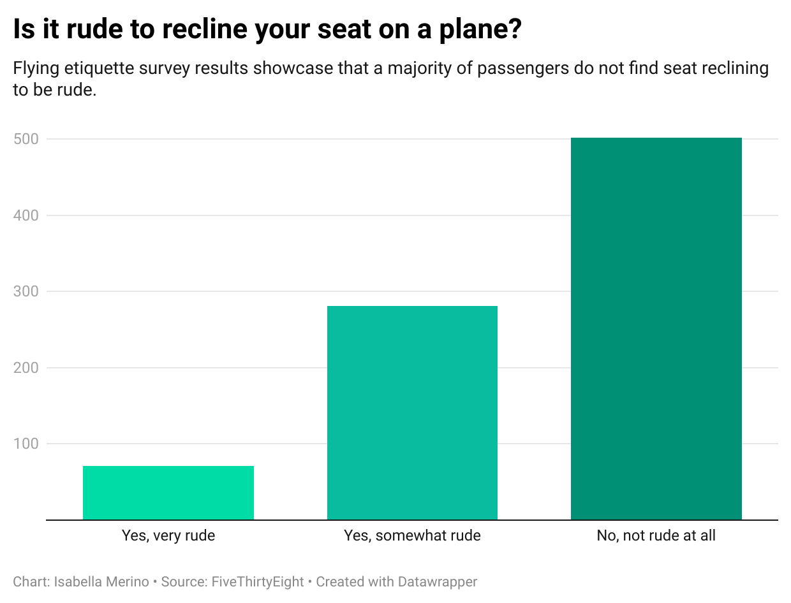

# **Part of flying etiquette survey results**

This is an insight into one of the [*FiveThirtyEight*](https://github.com/fivethirtyeight/data/tree/master/flying-etiquette-survey) flight etiquette survey results of whether passengers find seat reclining rude. 

## Why this piece of data was chosen to be highlighted

Although this survey included a variety of interesting questions and results, this particular question stood out as walking a fine line between rudeness and neutrality. Reclining one's seat on the airplane is an action due to comfort and relaxation, though it can annoy passengers in the back row quite extensively. With this in mind, the results of this question were particularly fascinating.  

## Results of the survey question

As seen in the chart above, from the 854 passengers that took this survey, most answered that seat reclining on an airplane is "not rude at all," with a whopping 502. On the other hand, a very small number of passengers answered by saying it is "very rude" with only 71. 
